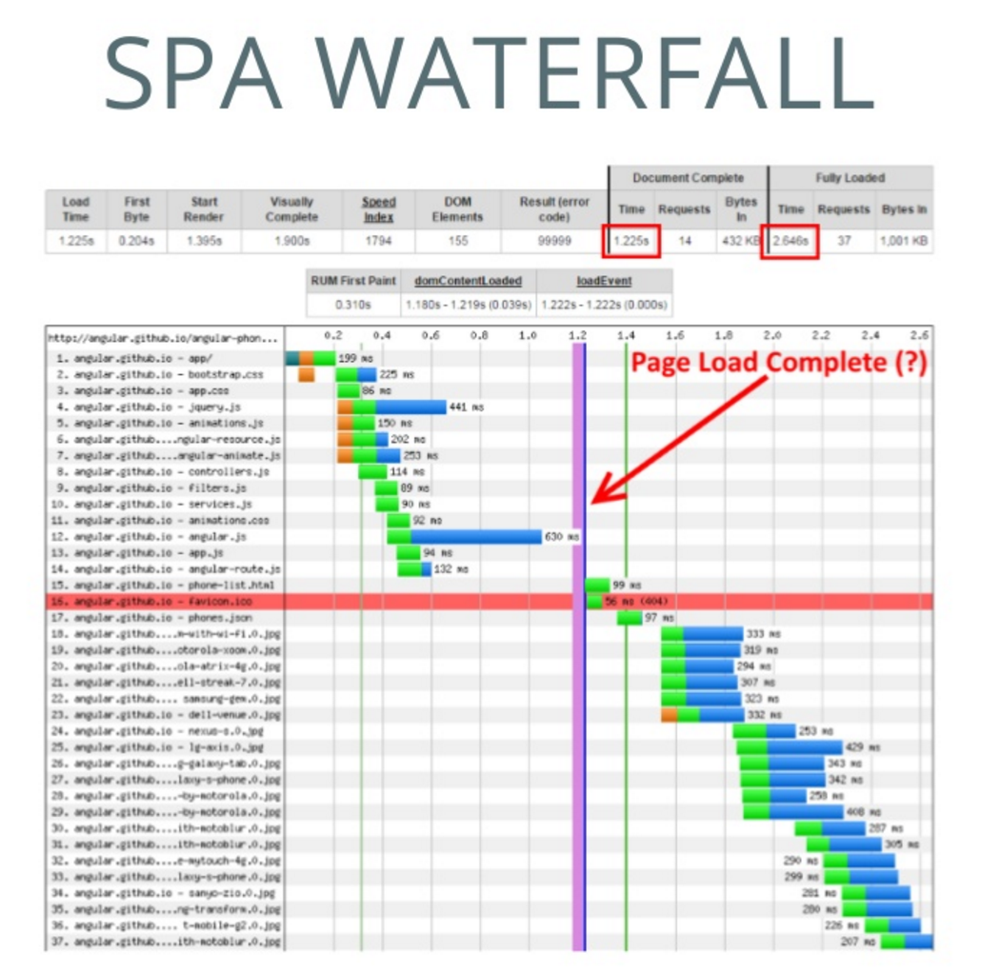
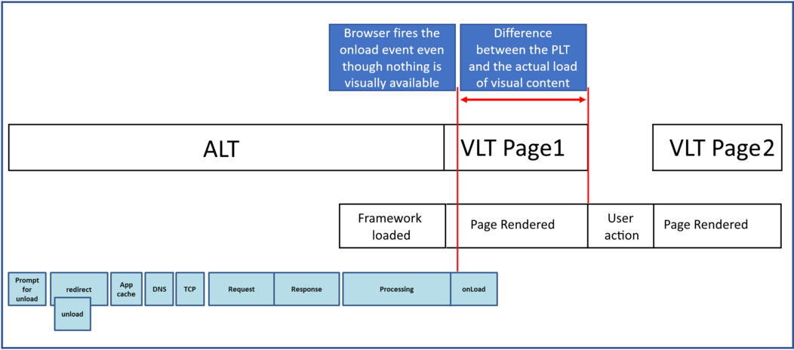

# Mezzurite

The Mezzurite API standardizes the collection, logging and reporting of performance markers for Single Page Applications (SPA). Mezzurite allows you to collect Real User Monitoring (RUM) data allowing you access to real world insight on performance issues your customers might be facing.

Mezzurite exists because traditional metrics like Page Load Time (PLT) are not relevant to the performance of SPAs due to their dynamic content update nature. Developers that realize this often use custom markers to track their performance, which may or may not be useful. Our goal is to:
1. Make it easy to capture relevant performance markers for single page applications
2. Standardize these metrics so that the performance of different sites are comparable

## Frameworks Supported
- React
- Angular 6
- Angular 2 through 5
- AngularJS

## Background
### What is a Single Page Application?
These are web applications built using JavaScript frameworks that run as a single page. The framework takes care of dynamically pulling in the content required for the page instead of the whole page being torn down by the browser and a new page fetched. Since only specific portions of the page are updated instead of the entire page, the performance is noticeably better. The navigational experience is also smoother. There is an ongoing trend of converting static web sites to single page applications for the performance/experience benefits.

### Measuring the performance of traditional web sites
Traditional web sites are built as static web sites, where on page load all the assets are statically linked to the page being downloaded. Browsers traditionally fire the onload event when all of these assets are loaded into the Document Object Model (DOM), indicating the end of the page load. The time it takes from the initial request till the onload event is triggered is know as the Page Load Time. This is one of the standard metrics used to measure web site's performance.

### Challenges facing the performance measurement for Single Page Applications
There are 2 main challenges facing the performance measurement of Single Page Applications:
1. The onload event that the PLT relies on continues to get fired after the static assets get downloaded, which is the case for static web sites as well, however in the case of SPAs, there is additional content that needs to get loaded, that the framework dynamically updates. i.e. the onload event gets fired for a single page application much before all the page's content is available, making the PLT meaningless while measuring the performance of SPAs.
2. From a browser perspective, there is only a single page that gets loaded in the browser. Navigations within SPA are handled by the framework and don't come in as new page requests to the browser.

### Visual representation of the challenges of using standard metrics with SPAs
The below image shows a few things:
1. The onload event gets fired at the 1.225s mark
2. There is still a bunch of activity after the onload event is fired, representing the dynamic updates by the JavaScript framework
3. The SPA is fully loaded at the 2.6s mark, way after the PLT was fired

## The Mezzurite Approach
Since SPA performance cannot be tracked in terms of PLT and other standard metrics we concluded that there was a need for new metrics that are applicable to SPAs. Working with different partners we identified the following:
1. SPAs are heavily dependent on the framework they use.
2. SPAs are created in terms of a set of individual components.

### Mezzurite Metrics
Using the above, we created the following metrics as relevant to the measurement of SPA performance:

#### Application Load Time (ALT)
- Captures time between when the url was requested until when the SPA framework is completely loaded. This mainly captures the network time, the server response time and time it takes to load the application framework into the DOM.
- To measure the ALT, we hook into the framework router, and record the first known route change. We subtract this time from the navigation start: ALT == #routeChange1 - navigationStart
  
#### Component Load Time (CLT)
- Time it takes for a component to load on the SPA page.
- To measure CLTs, we instrument individual components. We hook into the framework's component lifecycle and take the timings from the initialization method of the component. CLT = component init end - component init start
  
#### Viewport Load Time (VLT)
- Time taken to render the part of SPA page that fits the viewport for the form factor on which page is being viewed. Components on the page that are outside of the viewport are, by definition, not considered while calculating this metric.
- To measure VLTs, we look at the individual components that have been recorded on the page as well as their current location in the DOM, then we find which one was the slowest within the viewport and subtract its time from the last route change that happened. VLT = (slowest component in viewport) init end (in ticks) - last route change time (in ticks)

#### Time to First Viewport Load Time (TTFVLT)
- Time duration between the first time a SPA url is requested by the client to when content gets rendered within the browser viewport.
- This is the application load time + the viewport load time for the page that was first routed to TFVL = ALT + VLT

### Comparing Mezzurite metrics with W3C timings

#### Capture scenarios supported
1. Full page tracking: This is applicable when the site is owned completely by the team implementing Mezzurite. This covers:
    - Tracking the initial Application Load Time (ALT)
    - For each route change, the Viewport Load Times (VLT) are captured allowing for a view by view measurement of performance
    - Individual component performance
2. Component only tracking: This is applicable when individual teams own individual components that they would like to track the performance of, but the site that the component is hosted on is owned by another team. In this case Mezzurite provides the developers with an easy way to identify the individual CLTs that they own irrespective of how well or poorly the rest of the site performs. This scenario is currently supported only for React.

## Onboarding
### Framework-Specific Documentation
- [Mezzurite-React](./Mezzurite.React/README.md)
- [Mezzurite-Angular 6](./Mezzurite.Angular/README.md)
- [Mezzurite-Angular 2 through 5](./Mezzurite.Angular2_5/README.md)
- [Mezzurite-AngularJS](./Mezzurite.AngularJS/README.md)

## Limitations
- Currently do not track component loads that happen without a navigation to a new route.
- With React, componentDidMount reflects the outer-most component, not its children. In most cases this is adequate, but for performance this means that the component can theoretically be marked complete before it's child resources have been completely downloaded. We have since added slowestResourceTiming to each component with a child resource (IMG) to better differentiate between these two values.

## Contributions
[To read about contributing to this repo, click here](CONTRIBUTING.md)
